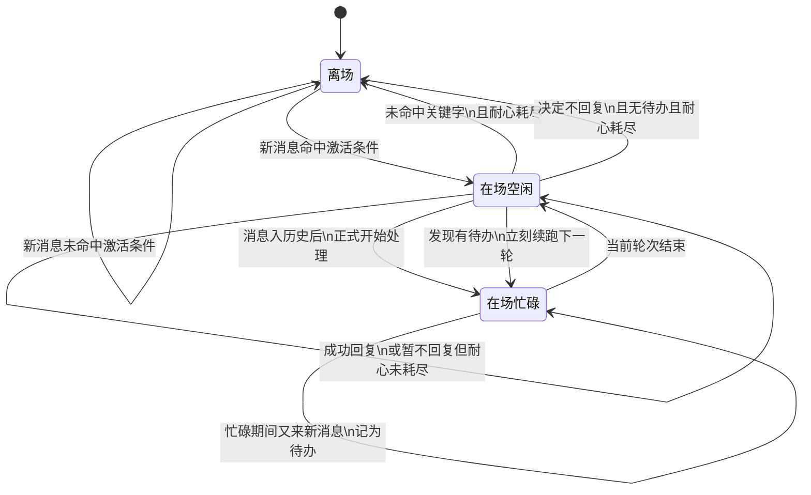
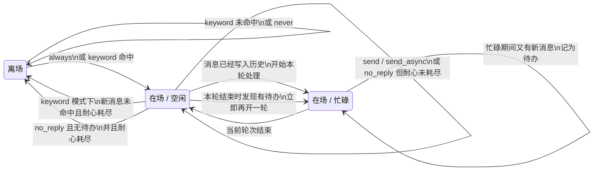

# 远程联系人状态机说明

这份文档只用业务语言说明远程联系人的状态流转，不讨论代码实现细节。

## 这套状态机在管什么

它主要解决 5 件事：

1. 联系人来消息时，当前要不要理他
2. 正在忙的时候，又来了新消息，要不要记成待办
3. 这一轮回复结束后，是继续在场，还是离场
4. 如果忙碌期间积压了待办，忙完后要不要立刻继续处理
5. 决定“不回复”时，要不要算成一次真实回复

## 核心状态

这套状态不是一个单一值，而是几项组合出来的。

### 1. 在场状态

- `离场`
  - 当前不会主动接待这位联系人
  - 只有满足激活条件时才会重新回来

- `在场`
  - 当前还愿意继续接待这位联系人

### 2. 工作状态

- `空闲`
  - 当前没有在处理这一位联系人的消息

- `忙碌`
  - 当前正在处理这一位联系人的一轮消息

### 3. 待办标志

- `无待办`
  - 当前没有积压的新消息

- `有待办`
  - 忙碌期间又来了新消息
  - 当前轮次结束后要立刻继续处理

### 4. 边界标志

- `需要插入上下文边界`
  - 这位联系人刚从“离场”重新回到“在场”
  - 下一轮正式处理前，要先做一次上下文滑窗

### 5. 上次成功回复时间

这不是状态名，但它会影响是否离场。

- 只有真正成功回复了对方，才会刷新这个时间
- 明确“不回复”不会刷新它

## 配置项

### 激活方式

- `always`
  - 只要对方来消息，就重新接待

- `keyword`
  - 只有消息里命中了关键字，才重新接待

- `never`
  - 不会因为新消息自动重新接待

### 激活关键字

- 仅在 `keyword` 模式下生效
- 当前规则是最简单的“消息里包含这个词就算命中”

### 耐心时间

- 默认 `60` 秒
- 含义是：
  - 如果当前人在“在场 + 空闲”
  - 新消息又没有命中关键字
  - 并且距离上次成功回复已经超过这段时间
  - 那就直接离场

## 总览图

## 更细一点的组合态图

## 触发状态变化的 4 个时机

### 1. 新消息刚进来时

这时会决定：

- 当前要不要理这条消息
- 如果人在离场，是否重新回来
- 如果人在在场但已经太久没成功回复，是否直接离场

### 2. 消息已经写进历史时

这时会决定：

- 是否正式开始新一轮处理
- 如果刚从离场回来，是否先做一次上下文边界
- 如果当前已经忙碌，是否把新消息记成待办

### 3. 当前这一轮结束时

这时会决定：

- 从忙碌切回空闲
- 要不要更新“上次成功回复时间”
- 要不要离场
- 如果有待办，要不要立刻再开一轮

### 4. 异步外发真正完成时

如果这一轮选择的是“异步发给远程联系人”，要等真正发送成功后，才算一次成功回复。

## 详细流转规则

## 1. 离场 -> 在场

条件：

- 激活方式是 `always`
- 或激活方式是 `keyword`，并且消息命中了关键字

结果：

- 联系人重新回到在场
- 会打上“需要插入上下文边界”的标记
- 这条消息允许进入后续处理

说明：

- 这一步只是“重新接待”
- 还不是“正式忙起来”

## 2. 离场保持不变

条件：

- 激活方式是 `keyword`，但消息没命中关键字
- 或激活方式是 `never`

结果：

- 只记录消息
- 不启动处理

## 3. 在场 + 空闲 -> 离场（提前离场）

条件：

- 当前是“在场 + 空闲”
- 激活方式是 `keyword`
- 新消息没有命中关键字
- 并且距离上次成功回复已经超过耐心时间

结果：

- 当场直接离场
- 这条消息不再触发处理

说明：

- 这是“看到新消息当下就直接离场”
- 不再等模型先跑一轮再决定不回

## 4. 在场 + 空闲 -> 在场 + 忙碌

条件：

- 联系人已经在场
- 当前也不忙
- 这条消息已经正式写入历史

结果：

- 正式进入忙碌状态
- 开始处理这一轮
- 如果之前刚从离场回来，会先插入一条上下文边界，再开始这一轮

## 5. 在场 + 忙碌时又来了新消息

条件：

- 当前正在忙

结果：

- 不会并发再开一轮
- 不会打断当前轮次
- 只会把“有新消息待办”这个标志记下来

说明：

- 这个待办的真正意义就是：忙完以后继续办

## 6. 忙碌 -> 空闲

每一轮结束时，都会先从忙碌切回空闲。

然后再根据这一轮的结果，决定：

- 是否更新上次成功回复时间
- 是否继续在场
- 是否立即处理待办

## 7. 本轮结果是 send

含义：

- 这轮明确给对方发了内容

结果：

- 联系人继续保持在场
- 这次会算作一次成功回复
- 会刷新“上次成功回复时间”

## 8. 本轮结果是 send_async

含义：

- 这一轮决定异步外发

结果：

- 当前轮次结束时，联系人先保持在场
- 但这时还不算成功回复
- 只有远程平台真的发送成功后，才会刷新“上次成功回复时间”

说明：

- 异步发送失败，不算成功回复

## 9. 本轮结果是 no_reply

含义：

- 这一轮明确决定不回复

结果：

- 工具会先固定等待 `7` 秒
- 然后本轮结束
- 这次**不算**成功回复
- 所以不会刷新“上次成功回复时间”

后续状态：

- 如果没有待办：
  - 耐心已经耗尽：离场
  - 耐心还没耗尽：继续在场
- 如果有待办：
  - 继续在场
  - 并准备接着处理下一轮

说明：

- `no_reply` 的真实语义不是“立刻跳过”
- 而是“我决定不回，并发呆 7 秒”

## 10. 待办自动续跑

条件：

- 当前这一轮结束前，忙碌期间又收到了新消息
- 也就是待办标志为真

结果：

- 当前轮次结束后，会先把待办标志清掉
- 联系人保持在场
- 然后立刻再开一轮处理下一批消息

说明：

- 这就是“忙完继续办”
- 现在待办不再只是一个摆设标志

## 特殊语义说明

### 1. 待办不是独立状态

不会单独显示成：

- `等待中`
- `挂起中`

它只是一个附加标志，含义是：

- 当前人在忙
- 忙的时候又来了新消息
- 这一轮结束后要立刻接着办

### 2. 上下文边界只在“重新回到在场”时插一次

作用：

- 避免离场很久后，上下文无限堆积
- 回来时先收口历史，再继续聊

### 3. 上次成功回复时间只认真正回复

会刷新：

- `send`
- `send_async` 真正发送成功

不会刷新：

- `no_reply`
- `send_async` 失败
- 单纯收到消息但没回

## 新消息处理流程

下面这段不是“状态定义”，而是“当一条新消息到来时，系统实际会怎么走”。

## 场景一：联系人发来一条新消息

1. 系统先判断这位联系人当前是不是离场
2. 如果是离场：
   - `always`：直接重新接待
   - `keyword`：只有命中关键字才重新接待
   - `never`：继续离场，只记录消息，不处理
3. 如果当前已经在场：
   - 并且当前空闲：
     - 正常继续本轮流程
   - 并且当前忙碌：
     - 不会打断当前轮次
     - 只把这条新消息记成待办

## 场景二：消息被正式写入会话历史

1. 消息先进入正式历史
2. 如果这位联系人当前仍然离场：
   - 到这里就结束
   - 只记录，不处理
3. 如果联系人当前在场并且空闲：
   - 系统把他切成忙碌
   - 开始本轮处理
4. 如果联系人当前在场但已经忙碌：
   - 不会并发再开一轮
   - 只维持“有待办”

## 场景三：开始本轮处理前

如果这位联系人刚刚是从离场重新回来的：

1. 系统会先做一次上下文边界整理
2. 把旧历史收口
3. 再开始这一轮正式处理

这样可以避免离场很久后，历史上下文越堆越重。

## 场景四：本轮处理中

这一轮里，模型最终必须做一个明确决策：

- 回复
- 异步回复
- 不回复

如果这时又来了新消息：

- 不会插队
- 不会并发
- 只会记成待办

## 场景五：本轮结束

当前轮次结束时，一定会先从“忙碌”回到“空闲”。

然后再根据本轮决策分支处理：

### 情况 A：正常回复

- 继续保持在场
- 刷新“上次成功回复时间”

### 情况 B：异步回复

- 当前轮次先结束
- 先保持在场
- 要等远程平台真正发送成功，才刷新“上次成功回复时间”

### 情况 C：决定不回复

- 先发呆 7 秒
- 再结束本轮
- 不刷新“上次成功回复时间”
- 然后再看：
  - 是否有待办
  - 耐心是否耗尽

## 场景六：本轮结束后发现有待办

如果这一轮忙碌期间积压了新消息：

1. 当前轮次结束
2. 系统清掉待办标志
3. 继续保持在场
4. 立刻再开下一轮

这就是“忙完继续办”。

## 场景七：什么时候会自动离场

有两种主要情况：

### 1. 新消息到来当下直接离场

条件：

- 当前在场
- 当前空闲
- 激活方式是关键字
- 新消息没命中关键字
- 距离上次成功回复已经超过耐心时间

结果：

- 当场离场
- 这条消息只记录，不处理

### 2. 本轮决定不回复后离场

条件：

- 当前没有待办
- 决定不回复
- 并且耐心已经耗尽

结果：

- 本轮结束后离场

## 用一句更顺的话总结整条链

一条新消息来了以后，系统会先判断“还要不要接待这个联系人”，再决定“要不要开始这一轮处理”；如果已经在忙，就先记待办；忙完以后如果有待办就立刻续办；如果很久没有成功回复，而这条消息又没触发继续接待的条件，就自动离场。

## 当前默认值

- 激活方式默认：`never`
- 耐心时间默认：`60` 秒
- `no_reply` 发呆时间：`7` 秒

## 一句话总结

这套状态机的核心逻辑就是：

- 离场时，只在满足激活条件时回来
- 在场时，空闲才会开始处理
- 忙碌时新消息先记成待办
- 忙完后如果有待办，就立刻继续办
- 如果长时间没有成功回复，且新消息又没命中关键字，就自动离场
- 如果决定不回复，只发呆 7 秒，但不算一次成功回复
