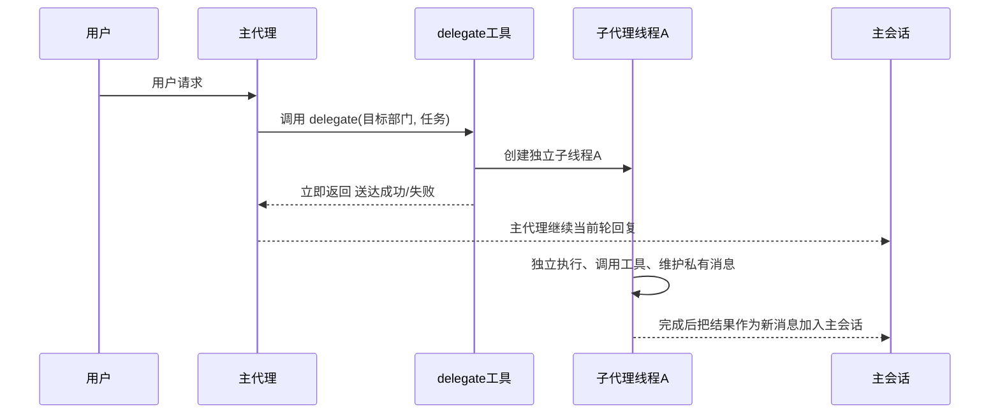
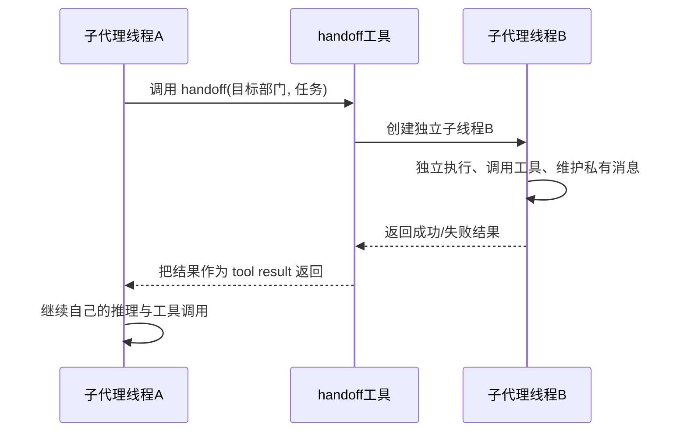
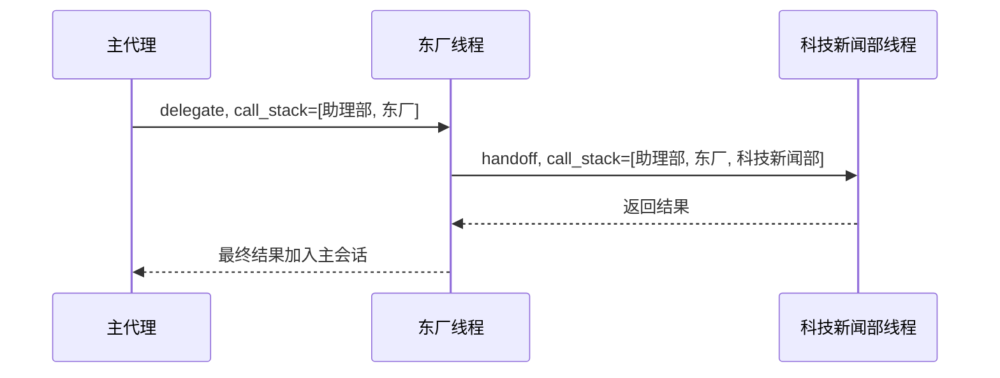

# 20260312 委托线程模型重构计划

## 1. 目标

本轮目标是彻底重构 `delegate` / `handoff` 的运行时模型，收口为统一的“子代理线程”架构：

- `delegate` 和 `handoff` 都会启动一个新的独立子代理线程
- 子代理线程拥有自己独立的消息、工具、调用链与执行状态
- 子代理线程不读取主会话，不扫描历史消息，不写主聊天硬盘记录
- 子代理线程完成后，只把成功或失败结果投递到指定目标
- 不做旧实现兼容，不保留任何旧的子代理会话残留

## 2. 最终语义

### 2.1 子代理线程

每一次 `delegate` 或 `handoff` 调用，都会创建一个新的独立子代理线程。

子代理线程与主代理在执行模型上没有本质区别，唯一差异只有：

- 主代理会推前端流式，并写正式主会话
- 子代理不推前端，不写主会话硬盘记录

除此之外，两者都应具备：

- 自己的消息列表
- 自己的工具循环
- 自己的 abort handle
- 自己的上下文整理能力
- 自己的执行结果

### 2.2 `delegate`

- 只有主代理可用
- 发起后只返回“送达成功 / 送达失败”
- 不等待下级真正执行完成
- 下级完成后，其结果作为一条新消息加入主会话

### 2.3 `handoff`

- 运行在某个子代理线程内部
- 是阻塞工具
- 会等待下级子代理线程返回结果
- 当前线程拿到结果后继续自己的推理与工具调用

### 2.4 调用链

调用链是**委托线程自己的私有运行时属性**，不是主会话属性，也不是消息残留属性。

调用链只用于一件事：

- 防止把任务踢回上级或祖先部门

调用链不用于：

- 限制同一部门并发接多单
- 通过扫描历史消息猜测当前任务上下文

同一部门可以同时处理多份任务，互不影响。

## 3. 核心模型

### 3.1 委托记录

SQLite 中的 `DelegateEntry` 继续承担“业务记录”职责：

- 委托 ID
- 父委托 ID
- 来源部门 / 目标部门
- 来源人格 / 目标人格
- 标题 / 指令 / 状态 / 时间

它是审计记录，不是运行时线程上下文本体。

### 3.2 运行时线程

运行时线程应驻留在 `AppState` 内存中，例如：

```rust
struct DelegateRuntimeThread {
    delegate: DelegateEntry,
    conversation: Conversation,
    reply_target: DelegateReplyTarget,
}
```

其中：

- `delegate`
  - 保存业务身份、调用链、上下级关系
- `conversation`
  - 复用现有 `Conversation` 结构，仅作为线程私有消息容器
- `reply_target`
  - 决定结果回给主代理还是父线程

### 3.3 结果目标

```rust
enum DelegateReplyTarget {
    MainConversation { root_conversation_id: String },
    ParentThread { parent_delegate_id: String },
}
```

语义：

- `delegate` 创建的新线程，结果回主会话
- `handoff` 创建的新线程，结果回父线程

## 4. 线程启动参数

每次启动新线程时，必须显式传入完整上下文，不允许运行时从外部推断：

- `delegate_id`
- `parent_delegate_id`
- `root_conversation_id`
- `source_department_id`
- `target_department_id`
- `source_agent_id`
- `target_agent_id`
- `instruction`
- `background`
- `deliverable_requirement`
- `call_stack`
- `reply_target`

其中 `call_stack` 的构造规则为：

- 主代理发起 `delegate`
  - `call_stack = [主代理部门, 目标部门]`
- 子线程发起 `handoff`
  - `new_call_stack = 当前线程.call_stack + [新目标部门]`

检查是否允许转交时，只检查：

- 目标部门是否已存在于当前线程的 `call_stack`

如果已存在，则拒绝，原因是防止踢皮球。

## 5. 时序图

### 5.1 `delegate`



### 5.2 `handoff`



### 5.3 多级转交



## 6. 必须删除的旧实现

以下旧路径必须移除，不保留兼容兜底：

### 6.1 从消息反推委托链

禁止继续使用类似逻辑：

- 从 `provider_meta` 提取 `delegateId/callStack`
- 从最近消息里倒序扫描“当前委托上下文”
- 根据历史消息猜测父委托或调用链

原因：

- 历史残留会污染新任务
- 会误判“当前已在调用链中”
- 会错误限制同一部门并发

### 6.2 把子代理线程写进主聊天会话

禁止继续把子代理的私有消息写入：

- `AppData.conversations`
- 主会话索引
- 委托对话历史文件

子代理线程的 `Conversation` 仅存在于内存 runtime 中。

### 6.3 子代理运行时回退到主会话

禁止以下行为：

- 找不到子代理上下文时回退到主助理主会话
- 用 `latest_active_conversation_index(...)` 代替子线程上下文
- 用 `agent_id` / `department_id` 推断当前线程

线程上下文只能按当前线程自己的唯一 ID 获取。

## 7. 实现步骤

### 7.1 新增运行时线程容器

在 `AppState` 中新增委托线程运行时容器，例如：

- `delegate_runtime_threads: HashMap<String, DelegateRuntimeThread>`

key 必须是当前线程唯一 ID，例如 `delegate_id`。

### 7.2 统一线程创建

统一由专门 helper 创建子线程：

- `delegate_runtime_thread_create(...)`
- `delegate_runtime_thread_get(...)`
- `delegate_runtime_thread_update(...)`
- `delegate_runtime_thread_remove(...)`

### 7.3 统一结果出口

- `delegate` 子线程完成后，结果投递主会话
- `handoff` 子线程完成后，结果返回父线程

### 7.4 统一 tool session

子线程内部工具运行的 session key 必须绑定到当前线程唯一 ID。

禁止继续只按：

- `api_config_id`
- `agent_id`
- `department_id`

这种粗粒度 key 挂工具运行态。

## 8. 验收标准

- 同一部门可并发处理多份任务，互不干扰
- 旧委托残留不会影响新任务
- `delegate` 启动后立即返回，不等待结果
- `handoff` 阻塞等待子结果并继续父线程
- 子代理私有消息不会进入主聊天硬盘记录
- 防循环只在同一条调用链内部生效
- 不再存在“通过主会话猜当前委托链”的逻辑
