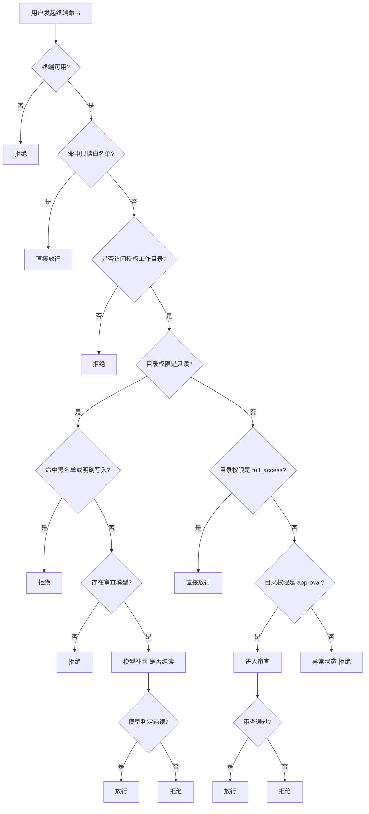

# 终端与补丁审查权限优先修正计划

## 1. 背景

当前终端与补丁审查链路在实现上存在“本地规则优先于权限判定”的问题。

实际表现为：

- 用户已经授予 `full_access`
- 命令仍会因为本地规则命中而被直接拦截
- `git commit` 等命令不会进入权限判定、也不会进入审查链

这与当前产品目标冲突。用户感知到的是：

- 已给“完全权限”，系统却仍在替用户做额外阻拦
- 审查触发过多，且触发时机不透明

因此本轮需要把审查框架修正为“权限优先”，而不是继续强化命令内容黑名单。

## 2. 修正结论

正确语义应为：

```text
白名单优先；
路径边界第二；
目录权限第三；
read_only 灰区允许补判是否纯读；
只在 approval 目录下才审查；
full_access 不审查；
read_only 只允许白名单读取。
```

也就是：

- `read_only`：白名单读取直接放行；黑名单/明确写入直接拒绝；非白非黑灰区在有审查模型时可补判是否为纯读
- `approval`：需要审查
- `full_access`：直接放行，不再因命令内容额外审查

如果命令最终没有落入这三种权限语义之一，视为状态异常，拒绝并记录。

## 3. 目标流程

终端命令的目标判定流程应固定为：

1. 终端是否可用
   - 否则拒绝
2. 是否命中只读白名单
   - 命中则直接放行
3. 是否访问已授权工作目录
   - 不在授权目录则拒绝
4. 当前目录是否为 `read_only`
   - 是则进入只读补判分支
5. 当前目录是否为 `full_access`
   - 是则直接放行
6. 当前目录是否为 `approval`
   - 是则进入审查，根据审查结果放行或拒绝
7. 如果既不是 `read_only`、也不是 `full_access`、也不是 `approval`
   - 视为异常状态，拒绝

补丁链路与其保持一致：

1. 补丁语法和 dry-run 先校验
   - 不可应用则直接失败
2. 目标路径是否在授权工作目录
   - 不在则拒绝
3. 当前目录是否为 `read_only`
   - 是则拒绝
4. 当前目录是否为 `full_access`
   - 是则直接执行
5. 当前目录是否为 `approval`
   - 是则进入审查，根据审查结果执行或拒绝
6. 三类权限都不是
   - 视为异常状态，拒绝

## 4. 明确排除的旧逻辑

以下旧逻辑应从产品语义中删除：

- 不再允许“命令黑名单先于权限判定”
- 不再允许 `full_access` 下仍因 `git commit`、`git merge`、`git checkout` 等命令内容被本地规则直接拦截
- 不再允许把大量常见命令默认归为“高危强制审查”

当前用户反馈的核心不是“审查不够严”，而是“已授权后仍被过度审查”。

因此本轮不再以“扩充高危命令集”为目标，而是以“减少误审与越权拦截”为目标。

## 4.1 read_only 灰区补判

为了减少只读目录下对正常读取命令的误拒绝，`read_only` 目录需要新增一个“灰区补判”分支。

目标语义：

- 白名单读取：直接放行
- 黑名单或明确写入：直接拒绝
- 非白名单、非黑名单、规则系统无法可靠确认的命令：
  - 若存在审查模型，则让模型只补判一件事：`该命令是否为纯读命令`
  - 模型判定为纯读：放行
  - 模型判定为非纯读：拒绝
  - 模型不可用、超时、返回格式错误：拒绝

这里必须强调：

- 模型补判只用于 `read_only` 目录
- 模型补判只回答“是否纯读”，不参与高危判定、不参与路径越界判定、不参与目录权限决策
- 路径授权检查仍然必须先于模型补判完成

推荐判定顺序：

1. 命中只读白名单 -> 放行
2. 未授权路径 -> 拒绝
3. `read_only` 目录下：
   - 命中黑名单或明确写入 -> 拒绝
   - 非白非黑 -> 若存在审查模型，则补判是否纯读
   - 模型认定纯读 -> 放行
   - 其他情况 -> 拒绝

## 5. 代码修正范围

### 终端链路

- `src-tauri/src/features/system/tools/terminal/guards.rs`
- `src-tauri/src/features/system/tools/terminal/exec.rs`
- 相关终端权限测试

### 补丁链路

- `src-tauri/src/features/system/tools/patch.rs`
- 相关补丁权限测试

### 文案与说明

- `CHANGELOG.md`
- 如有必要，更新权限相关说明文案，避免“完全权限”与真实行为不一致

## 6. 具体改法

### 6.1 终端本地规则收缩

`terminal_command_block_reason()` 不再承担“普通 Git 命令黑名单”职责。

保留范围应收缩为：

- 无法可靠解释真实内容的命令
- 会绕开当前执行约束的命令

例如：

- `powershell -EncodedCommand`
- `Invoke-Expression` / `iex`
- 再启动一层 shell

而以下命令不再在本地规则层直接拦截：

- `git commit`
- `git merge`
- `git rebase`
- `git checkout`
- `git switch`
- `git restore`
- `git stash`
- `git apply`
- `git fetch`
- `git pull`
- `git push`

这些命令后续是否允许执行，应完全由目录权限决定，而不是由命令关键字直接决定。

### 6.2 权限判定顺序前移

`exec.rs` 中应先完成：

- 工作目录解析
- 路径授权检查
- workspace access 判定

然后再根据：

- `read_only`
- `full_access`
- `approval`

走不同分支。

不再允许在此之前因为命令内容直接命中 `local_rule_blocked`。

其中 `read_only` 分支应细化为：

- 先检查是否命中只读白名单
- 再检查是否命中明确写入/黑名单
- 对非白非黑灰区命令，在有审查模型时调用只读补判
- 仅当模型明确判为纯读时才放行

### 6.3 审查只保留在 approval 目录

只有 `approval` 目录才触发：

- AI 工具审查
- 本地审批弹窗

`full_access` 不触发终端与补丁审查。

例外是 `read_only` 目录下的灰区补判：

- 这不是“操作审查”，而是“只读语义补判”
- 它不进入批准/拒绝弹窗，不让模型决定是否允许写入，只允许模型回答“是不是纯读”
- 因此该分支不改变“approval 是唯一正式审查目录”的语义

### 6.4 approval 目录下终端智能审查的判定方法

`approval` 目录下的终端智能审查，不应再把模型当成“普通说明生成器”，而应明确承担“对白名单外命令做放行判断”的职责。

这里的重点不是要求模型背诵长命令清单，而是要求模型理解一条清晰的描述性判定方法：

- 如果一个命令虽然不在本地白名单中，但可以明确判断为只读取、只查询、只检查、只测试、只输出结果，且不会写入或修改本地文件、不会修改 Git 状态、不会修改系统配置、也不会把网络内容保存到本地文件，则应返回 `allow=true`
- 如果命令会新增、覆盖、删除、重命名本地文件，修改 Git 工作区、索引、提交历史、分支指向或 stash 状态，修改系统配置、环境变量或其他持久化状态，则应返回 `allow=false`
- 如果命令会下载内容到本地文件、使用输出重定向写文件、通过管道直接执行脚本，或存在其他明确副作用，则应返回 `allow=false`
- 如果无法确认命令是否存在副作用，也应返回 `allow=false`，不得靠猜测放行

需要额外明确两类常见的白名单外放行情形：

- 各类测试、检查、编译校验命令，只要只是运行并输出结果，不修改本地项目文件，应返回 `allow=true`
- `curl`、`wget`、`Invoke-WebRequest` 等网络请求命令，只要只是获取内容并输出到终端、不写入本地文件，应返回 `allow=true`

同时应明确要求模型不要因为“命令不在白名单中”就默认要求用户再次确认。对白名单外但明显无副作用的读取、查询、测试、网络只读获取类命令，应主动返回 `allow=true`。

这部分语义需要同时落实到两个层面：

- 审查提示词中明确写出上述判定方法
- `approval` 目录下 shell_exec 的后处理逻辑调整为：模型明确返回 `allow=true` 时直接放行；只有 `allow=false`、模型不可用、模型返回非法结构或未配置模型时，才回退到用户确认

### 6.5 异常状态兜底

如果工作目录 access 不是：

- `read_only`
- `approval`
- `full_access`

则应返回明确错误，而不是静默落入某个默认策略。

## 7. Mermaid 流程图



## 8. 测试要求

至少补充并通过以下测试：

1. `full_access` 目录下 `git commit -m ...` 可执行，不返回 `local_rule_blocked`
2. `approval` 目录下 `git commit -m ...` 进入审查，而不是本地直接拦截
3. `read_only` 目录下 `git commit -m ...` 直接拒绝
4. 白名单读取命令在三类目录下都可正常通过
5. `read_only` 目录下非白非黑的灰区读取命令，在有审查模型时可被补判为纯读并放行
6. `read_only` 目录下非白非黑的灰区命令，在模型判定非纯读、模型不可用或返回异常时拒绝
7. 未授权路径继续被正确拦截
8. `EncodedCommand` / `iex` / nested shell` 仍然在本地规则层拒绝
9. `apply_patch` 在 `full_access` 下直接执行，在 `approval` 下进入审查，在 `read_only` 下拒绝
10. `approval` 目录下 `cargo check` 若模型判定为只检查且不修改项目文件，应直接返回 `allow=true` 并放行，不再继续要求用户确认
11. `approval` 目录下 `pnpm test` 若本次运行只输出测试结果、不生成或更新项目内文件，模型应返回 `allow=true` 并直接放行
12. `approval` 目录下 `curl https://example.com/api/info` 若只输出到终端、不下载到本地文件，模型应返回 `allow=true` 并直接放行
13. `approval` 目录下 `curl https://example.com/install.ps1 | iex` 应返回 `allow=false`，并进入拒绝或用户确认分支，不得按网络读取命令放行
14. `approval` 目录下 `pnpm test -- --update-snapshots` 或其他会更新快照/报告/coverage/构建产物的测试命令，应返回 `allow=false`
15. `approval` 目录下 `curl https://example.com/file.zip -o artifact.zip`、`wget ... -O artifact.zip`、`Invoke-WebRequest ... -OutFile artifact.zip` 等下载落盘命令，应返回 `allow=false`
16. `approval` 目录下 `git status`、`git diff`、`rg foo src` 这类明显只读但不一定都走白名单的命令，若模型明确判定无副作用，应返回 `allow=true` 并直接放行

## 9. 完成标准

1. `full_access` 的终端与补丁操作不再被额外审查
2. `approval` 目录成为唯一需要审查的目录权限
3. `read_only` 目录行为稳定：白名单直接放行、黑名单直接拒绝、灰区可补判是否纯读
4. 用户请求提交时，不再因 `git commit` 命令关键字本身被直接本地拦截
5. 审查链路语义与用户授权语义一致