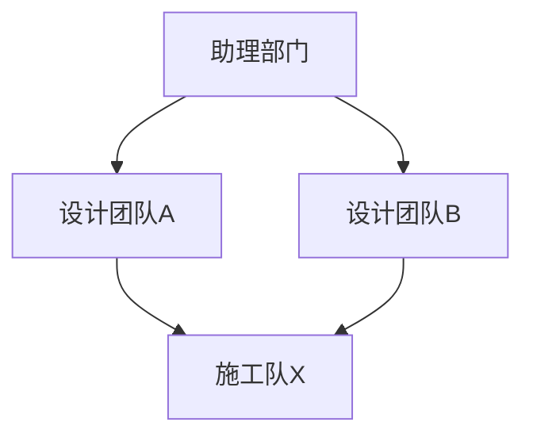

# 部门关系图与直接下级委托计划

## 背景

当前部门系统仍以 `副手部门 / isDeputy` 为核心语义：

- “能否被委托”由 `isDeputy` 决定。
- 委托候选本质上是一个全局副手池，而不是层级关系。
- 设置页只有“部门基础信息”页，没有专门维护上下级关系的入口。

用户希望彻底抛弃这套语义，改成“像政府部门一样”的层级关系，但同时允许多个上级共享同一个下级部门。因此产品名称仍可叫“部门树”，技术上实际是“有向层级关系图”。

## 已确认规则

- 废弃 `副手部门 / isDeputy / 副手人格 / 副手权限限制` 的全部业务语义。
- 不存“上级部门 id”。
- 只在部门上存“直接下级部门列表”。
- 任意部门只能把任务委托给自己的直接下级。
- 一个部门可以同时挂在多个上级下面。
- 页面展示使用 Mermaid 自动排布，所有部门都显示出来，用线表达 `上级 -> 下级`。
- 允许同一个部门在关系图中被多个上级共同指向。
- 禁止自指与环，例如 `A -> A`、`A -> B -> C -> A`。

## 当前链路事实

- 前端部门配置页入口在 `src/features/config/views/ConfigView.vue`，当前只有 `department` 页。
- 部门基础编辑集中在 `src/features/config/views/config-tabs/DepartmentTab.vue`。
- 前端部门类型在 `src/types/app.ts` 的 `DepartmentConfig`。
- 前端配置落盘映射在 `src/features/config/composables/use-config-persistence.ts`。
- 前端部门校验在 `src/features/config/utils/department-validation.ts`。
- Rust 部门配置结构在 `src-tauri/src/features/core/domain/types_config.rs` 的 `DepartmentConfig`。
- Rust 配置归一化在 `src-tauri/src/features/config/storage_and_stt.rs`。
- 当前提示词中的可委托部门构造在 `src-tauri/src/features/chat/conversation.rs`，按 `is_deputy` 过滤。
- 当前委托预检在 `src-tauri/src/features/chat/model_runtime/tools_and_builtin/delegate_dispatch.rs`，尚未按层级关系限制目标部门。
- 聊天输入区手动委托候选在 `src/features/chat/components/ChatComposerPanel.vue`，目前直接复用“所有可聊天部门”的列表。
- 仓库已经自带 Mermaid 依赖与渲染链路：
  - `package.json` 已包含 `mermaid`
  - `markstream-vue` 已在多个页面启用 `enableMermaid()`

## 目标方案

### 1. 数据模型从“副手布尔值”改为“直接下级列表”

前后端 `DepartmentConfig` 新增：

```ts
childDepartmentIds: string[]
```

对应 Rust：

```rust
child_department_ids: Vec<String>
```

语义：

- 存的是“本部门的直接下级部门 id 列表”。
- 不存父节点列表。
- 运行时若需要找“某部门的上级有哪些”，临时从全量部门反查。

同时废弃：

- `isDeputy / is_deputy`
- 副手部门专属工具限制
- 副手人格与普通人格互斥规则
- “可委托部门 = 全局副手部门集合”这套推导

### 2. 历史副手语义迁移策略

本轮不粗暴删除历史数据，而是做“去特殊化”迁移：

- 停止自动注入内置 `deputy-department`。
- 停止自动注入内置 `deputy-agent` 的特殊职责语义。
- 历史配置里如果已有 `deputy-department`，保留该部门记录，但它只作为普通部门存在。
- 历史配置里如果已有 `deputy-agent`，保留该人格记录，但不再参与任何特殊校验或默认回填。
- 历史 `isDeputy / is_deputy` 字段在读取时只用于兼容旧配置；归一化写回时不再继续输出该语义。

这样可以避免：

- 误删用户已经绑定到旧“副手”部门的会话与配置。
- 因强制删除旧节点导致历史会话、联系人或部门引用失效。

### 3. 设置页新增独立“部门树”页

在配置页新增一个独立 tab，例如：

- `departmentTree`

页面职责只做两件事：

- 维护每个部门的 `childDepartmentIds`
- 预览全局 Mermaid 部门关系图

页面建议结构：

1. 左侧或顶部选择当前要编辑的部门
2. 中间用多选列表、勾选卡片或候选清单维护“直接下级”
3. 下方或右侧实时渲染 Mermaid 关系图

明确边界：

- “部门”页继续负责名称、负责人、模型、概述、办事指南、权限等基础信息。
- “部门树”页只负责层级关系。
- Mermaid 仅负责展示，不承担拖拽编辑；关系编辑仍用表单，保证稳定性和可控性。

### 4. Mermaid 展示策略

Mermaid 使用 `flowchart TD`：



展示规则：

- 所有部门都生成一个节点。
- 每条 `parent -> child` 关系生成一条边。
- Mermaid 自动做自上而下排布。
- 同一个部门即使被多个上级引用，也只对应同一个节点，由多条入边指向它。

### 5. 委托规则切换为“只允许直接下级”

运行时委托规则改为：

- 当前部门可以委托给 `childDepartmentIds` 里的部门。
- 不允许越级直接委托给孙级或更深层部门。
- 如果中层部门需要继续分派，只能继续委托给它自己的直接下级。

需要改动的主要链路：

- 手动委托候选列表
  - `ChatComposerPanel.vue`
  - 从“全部可聊天部门”改为“当前会话部门的直接下级”
- 系统提示词中的可委托部门列表
  - `conversation.rs`
  - 从“全部副手部门”改为“当前部门的直接下级部门”
- 后端委托预检
  - `delegate_dispatch.rs`
  - 强校验 `target_department_id` 是否属于 `source_department.child_department_ids`
- 运行时调用链防环
  - 继续保留现有 `call_stack` 检查，作为运行时第二道保险

### 6. 部门关系校验规则

前后端统一校验：

- `childDepartmentIds` 去重、去空字符串
- 下级部门必须真实存在
- 不能把自己设为自己的下级
- 不能形成环
- 允许一个部门被多个上级同时引用

说明：

- 本轮不要求“唯一根节点”
- 允许多个根部门或多个独立子图并存
- 仍然保留 `assistant-department` 作为主会话的内置主部门，但它不是唯一合法根节点

### 7. 现有“部门创建/会话创建”语义保持不变

本轮只收紧“委托目标”，不收紧“可被用户直接选择的会话部门”：

- 新建会话时，用户仍可直接选择任意可聊天部门作为负责部门。
- 远程联系人绑定部门的逻辑先不改成层级限制。
- 只有“委托”动作改成“只能委托给直接下级”。

这样可以避免把“组织关系图”误扩展成“所有入口都必须走上级派发”的重构。

### 8. 搜索、文案与导航同步

新增 `departmentTree` 后，需要同步更新：

- `ConfigView.vue` 的 tab 枚举与菜单
- `src/features/config/search/config-search.ts`
- `src/locales/zh-CN.json`
- `src/locales/en-US.json`
- `src/locales/zh-TW.json`

建议文案：

- `config.tabs.departmentTree`: `部门树`
- 页面提示强调：
  - 基础资料在“部门”页维护
  - 这里只维护“直接下级”关系
  - 委托只能发给直接下级

## 实施步骤

### 阶段 1：数据结构与兼容层

1. 前后端 `DepartmentConfig` 增加 `childDepartmentIds / child_department_ids`
2. 配置映射与归一化补齐新字段
3. 停止自动创建内置副手部门与副手人格特殊语义
4. 旧 `isDeputy / is_deputy` 降级为只读兼容字段

### 阶段 2：关系校验与公共辅助函数

1. 新增部门关系图辅助函数：
   - 读取某部门的直接下级
   - 反查某部门的直接上级
   - 检测环
   - 生成 Mermaid 文本
2. 前端 `department-validation.ts` 接入图校验
3. Rust 归一化与运行时辅助函数接入同类校验

### 阶段 3：设置页新增“部门树”

1. 新增 `DepartmentTreeTab.vue`
2. 接入配置页菜单、tab 枚举、搜索入口、多语言文案
3. 在页面中编辑 `childDepartmentIds`
4. 复用现有 Mermaid 渲染链路做实时预览

### 阶段 4：委托语义切换

1. 前端手动委托候选改为“当前部门直接下级”
2. 后端 delegate 预检强制校验“目标必须是当前部门直接下级”
3. 系统提示词里的“可委托部门”说明改为“当前部门直接下级”
4. 移除副手专属说明、限制与提示文案

### 阶段 5：清理旧副手逻辑

1. 删除前端 `DepartmentTab.vue` 中的副手开关与相关交互
2. 删除前端副手专属校验与权限提示
3. 删除 Rust 中副手默认权限限制逻辑
4. 删除启动期“副手部门自检”与相关测试
5. 更新文档与变更日志

## 风险与注意事项

- 这是“数据模型 + 设置页 + 委托运行时”联动改造，不是纯 UI 功能。
- “多个上级共享一个下级”是被明确允许的，因此任何实现都不能强行要求唯一父节点。
- Mermaid 负责展示没问题，但大图场景下可读性可能下降；第一版先保证正确展示与关系编辑，不额外做复杂布局控制。
- 历史副手数据不能简单删除，否则容易破坏现有部门绑定、会话记录和用户理解。
- 本轮不把“部门关系图”扩展成“会话创建权限树”或“联系人绑定权限树”，避免范围失控。

## 最小验证

- `pnpm typecheck`
- `pnpm test -- --run use-config-core.test.ts` 或补充与部门关系校验直接相关的最小前端测试
- `cargo check --manifest-path src-tauri/Cargo.toml`
- 补充最小 Rust 单测：
  - 历史副手配置迁移为普通部门
  - 多父级共享下级合法
  - 自指非法
  - 环非法
  - 委托目标不是直接下级时拒绝

## 待你确认后的默认实现假设

- 历史 `deputy-department` 保留为普通部门，不自动删除。
- 历史 `deputy-agent` 保留为普通人格，不自动删除。
- Mermaid 预览直接复用现有渲染链路，不单独新引入图形编辑器。
- “部门树”页维护关系，“部门”页维护基础资料，两页职责分离。
