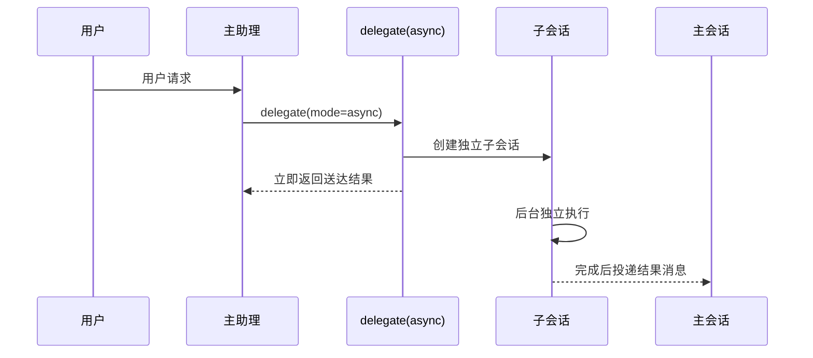
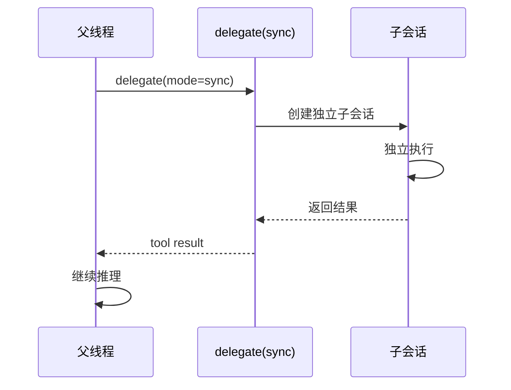

# 20260312 统一委托工具重构归档

## 1. 原始目标

- 把现有 `delegate` / `handoff` 两把工具统一为一把 `delegate` 工具，使用明确的 `mode` 参数表达执行语义
- `mode = "async"`：后台异步执行，立即返回送达结果，完成后可选择是否提醒主助理
- `mode = "sync"`：当前调用线程等待子结果，子任务完成后直接把结果作为 tool result 返回
- 不再保留对外暴露的 `handoff` 工具

## 2. 最终落地结果

- 已移除 `handoff` 工具，统一使用 `delegate` 工具
- 已实现 `mode` 参数支持 `async` / `sync` 两种模式
- 已实现委托线程内禁止再次调用 `delegate`（工具层+执行层双重禁止）
- 已修正运行身份：使用 `delegate_id` 作为运行 key，而非 `department_id`
- 已完成群聊消息队列与主助理串行调度系统，确保 `async` 结果先写历史再激活

## 3. 最终业务语义

### 3.1 工具统一

LLM 只需要理解一件事：
- `delegate` 是"向某个部门发起一次委托"
- 是否等待结果，由 `mode` 决定

### 3.2 权限控制

- `mode=async` 仅主助理部门可用
- `mode=sync` 当前线程等待子结果
- 任何委托线程内部都不允许再次调用 `delegate`（无论 `async` 还是 `sync`）

### 3.3 运行模型

- 子任务运行在独立子会话中，具备自己的消息列表、工具循环、上下文整理、调用链、运行状态
- 运行身份绑定线程唯一 ID（`delegate_id`），不支持使用 `department_id` 作为运行 key
- 同一部门可并发处理多份任务而互不干扰

## 4. 核心认知落地

### 4.1 部门不是运行实体

`department_id` 只是本次委托的路由模板，用来决定：
- 使用哪个部门的人设提示词
- 使用哪个部门的候选模型列表
- 使用哪个部门的主管人格身份

### 4.2 只有主助理占用前台流式

- 子委托线程可以独立运行、独立调用工具、独立持有运行时会话
- 子委托线程不直接占用主聊天窗口的流式展示位
- 前台聊天窗口永远只有主助理这一条前台流式轨道

### 4.3 async 结果进入主会话的方式

1. 子线程完成
2. 生成一条 `Delegate` 来源的待处理事件
3. 进入主聊天队列
4. 等主助理空闲后，由调度器统一出队
5. 先写入主会话正式历史
6. 再按 `activate_assistant` 决定是否开启下一轮主助理

## 5. 实现落地要点

### 5.1 后端

- `src-tauri/src/features/chat/model_runtime/tools_and_builtin.rs`
  - `DelegateMode` 枚举
  - `parse_delegate_mode` 解析函数
  - `builtin_delegate` 统一入口
  - `delegate_execute_sync` 同步执行

- `src-tauri/src/features/delegate/runtime.rs`
  - `delegate_runtime_thread_build` 中 `conversation.id = delegate.delegate_id`

- `src-tauri/src/features/chat/model_runtime/provider_and_stream/tool_assembly.rs`
  - `delegate_tool_runtime_disabled_reason` 委托线程内禁用检测

- `src-tauri/src/features/chat/scheduler.rs`
  - 群聊消息队列与主助理串行调度系统
  - `history_flushed` / `round_completed` / `round_failed` 事件

### 5.2 委托 Prompt 结构

委托线程专属提示词：
```
- 这是一条委托线程。此线程不存在默认用户人格。
- 只依据本轮委托任务块与本线程历史处理工作，不要自行补充用户设定、昵称或主会话背景。
```

不注入：主用户人格、自我介绍、主会话记忆、主会话归档摘要

## 6. 验收结果

| 计划要求 | 状态 |
|---------|------|
| LLM 只看到一把 `delegate` 工具 | ✅ |
| `mode=sync\|async` 均可正常工作 | ✅ |
| 同一部门可并发处理多份任务 | ✅ |
| `async` 后台运行并可回主会话 | ✅ |
| `sync` 等待子结果并继续父线程 | ✅ |
| 不再把 `department_id` 当运行身份 | ✅ |
| `async` 结果先写正式历史再激活 | ✅ |
| 后台批次无需手动刷新即可显示 | ✅ |
| 委托首轮 prompt 结构一致 | ✅ |
| 委托线程内禁用 `delegate` | ✅ |

## 7. 后续事项

以下属于后续优化，不再阻塞本计划归档：

- 委托线程并发性能监控与线程池优化
- 如需支持多级委托，需重新设计调用链和权限模型
- 补充委托模式的端到端测试用例

## 8. 归档结论

- "统一委托工具重构"已经从业务设计进入可运行实现。
- `delegate`/`handoff` 统一已完成，权限、运行身份、调度系统均已落地。
- 后续若继续扩展多级委托、委托会话中心等能力，应另开新计划推进。

---

# 原计划正文

# 20260312 统一委托工具重构计划

## 1. 目标

本轮目标是把现有 `delegate` / `handoff` 两把工具统一为一把 `delegate` 工具，使用明确的 `mode` 参数表达执行语义：

- `mode = "async"`
  - 后台异步执行
  - 立即返回送达结果
  - 完成后可选择是否提醒主助理
- `mode = "sync"`
  - 当前调用线程等待子结果
  - 子任务完成后直接把结果作为 tool result 返回

统一之后，LLM 只需要理解一件事：

- `delegate` 是"向某个部门发起一次委托"
- 是否等待结果，由 `mode` 决定

不再保留对外暴露的 `handoff` 工具。

## 2. 核心认知

### 2.1 部门不是运行实体

`department_id` 只是本次委托的路由模板，用来决定：

- 使用哪个部门的人设提示词
- 使用哪个部门的候选模型列表
- 使用哪个部门的主管人格身份

`department_id` 绝不能作为运行 key。

### 2.2 运行身份只能是线程 ID

每一份委托的真正运行身份，必须是运行时线程自己的唯一 ID，例如：

- `delegate_id`
- 或运行时 thread id

这样同一部门才能同时处理多份任务而互不干扰。

### 2.3 并发的关键不是"不同部门"，而是"不同线程"

以下两份任务即使都属于东厂，也必须能并发：

- 东厂任务 A -> runtime thread A
- 东厂任务 B -> runtime thread B

它们共享的只有：

- 东厂提示词模板
- 东厂模型候选
- 东厂主管人格

它们不能共享：

- 消息列表
- 当前工具调用状态
- abort handle
- 调用链
- 执行结果

### 2.4 只有主助理会占用前台聊天流式

这里必须明确：

- 子委托线程可以独立运行、独立调用工具、独立持有自己的运行时会话
- 但子委托线程不是前台聊天窗口，不直接占用主聊天窗口的流式展示位
- 前台聊天窗口永远只有主助理这一条前台流式轨道

因此：

- `delegate(mode="sync")`
  - 子线程结果只作为当前工具调用结果返回给父线程
- `delegate(mode="async")`
  - 子线程完成后，不直接改前台 UI
  - 而是把结果作为一条新的 `Delegate` 事件投递回主聊天消息队列
  - 由主聊天调度器决定何时刷入正式历史、何时激活主助理继续说话

## 3. 对外工具语义

### 3.1 `delegate(mode="async")`

- 仅主助理部门可拥有和发起
- 创建 durable 委托记录
- 创建独立子会话
- 后台执行
- 立即返回"委托已送达 / 委托无法送达"
- 完成后把结果投递回主会话
- `notify_assistant_when_done` 只在此模式下生效

### 3.2 `delegate(mode="sync")`

- 仅主助理部门可拥有和发起
- 当前线程阻塞等待子结果
- 子任务仍然运行在独立子会话中
- 子任务完成后，把结果直接返回给父线程
- 忽略 `notify_assistant_when_done`

### 3.3 委托线程内禁止再次调用 `delegate`

这是当前已经确认的硬规则，不再依赖提示词软引导：

- 任何委托线程内部都不允许再次调用 `delegate`
- 既不允许 `mode="async"`，也不允许 `mode="sync"`
- 工具组装层应直接隐藏该工具
- 即使被旧 prompt、旧缓存或手工 payload 硬调到后端，执行层也必须直接拒绝

目的不是"防踢皮球"这么简单，而是明确切断多级委托，把当前实现收口为单层委托模型，避免 reviewer 继续按旧的多级子代理思路理解代码

## 4. 运行模型

### 4.1 统一底层：独立子会话

无论 `sync` 还是 `async`，都必须运行在独立子会话里。

子会话应具备：

- 自己的消息列表
- 自己的工具循环
- 自己的上下文整理
- 自己的调用链
- 自己的运行状态

### 4.2 不同上层编排

共享的，只是底层子会话执行器。

不共享的，是上层编排：

- `async`
  - durable 存储
  - spawn 后台执行
  - 完成回主会话
- `sync`
  - 当前线程 await
  - 直接返回 tool result
  - 不额外通知主助理

### 4.3 `async` 结果进入主聊天的方式

`async` 委托完成后的正确路径不是"直接刷新前端"，而是：

1. 子线程完成
2. 生成一条 `Delegate` 来源的待处理事件
3. 进入主聊天队列
4. 等主助理空闲后，由调度器统一出队
5. 先写入主会话正式历史
6. 再按 `activate_assistant` 决定是否开启下一轮主助理

这里有两个硬边界：

- 入队不代表消息已生效
- 只有写入正式历史后，消息才算真正进入当前对话

所以 reviewer 不应把"入队时发一个 refresh"当作正确实现。
正确实现应以"历史写入完成后的通知"为准。

### 4.4 当前聊天窗口的通知边界

后台来源的批次消息要想立刻出现在当前聊天窗口，不能只靠全局刷新信号。

正确口径是：

- 当前聊天窗口需要绑定自己的长期 delta 通道
- 当某个后台批次被正式写入当前会话历史时，调度器向该窗口发送 `history_flushed`
- 如果本批次要求激活主助理，则后续主助理流式也继续走同一条窗口通道
- 主助理这一轮结束后，再发送 `round_completed` 或 `round_failed`

也就是说，前端的正确节奏是：

- `history_flushed`
  - 把本批次消息并入当前窗口
- `streaming`
  - 主助理继续前台流式
- `round_completed / round_failed`
  - 对齐最终结果

`easy-call:refresh` 只能作为兜底刷新，不应承担主状态同步职责。

### 4.5 委托首轮 prompt 结构

所有委托首轮都必须使用同一结构，不能再混入普通聊天 prompt 的旧包装文本。

目标结构：

```json
{
  "messages": [
    {
      "role": "system",
      "content": "全局规则 + 人格 + 部门说明 + 技能说明 + 工作区说明"
    },
    {
      "role": "user",
      "content": [
        {
          "type": "text",
          "text": "[DELEGATE TASK]\\n委托任务：...\\n核心指令：...\\n背景：...\\n具体目标：...\\n交付要求：..."
        },
        {
          "type": "text",
          "text": "[派蒙] 2026-03-12T20:19:06+08:00"
        }
      ]
    }
  ]
}
```

必须满足：

- 技能说明只允许出现在 `system`
- 工作区说明只允许出现在 `system`
- 委托正文必须完整出现在第一块 `user.content`
- 说话人和时间必须是独立的第二块 `user.content`
- 不允许再额外包一层"请处理《xxx》"
- 不允许默认注入主用户人格、自我介绍、主会话记忆、主会话归档摘要
- 不允许把系统级隐藏块塞进用户消息

## 5. 调用链

调用链始终是线程私有运行时属性，只用于一件事：

- 防止把任务踢回祖先部门

调用链不用于：

- 当运行 key
- 从历史消息里反推当前线程
- 限制同一部门并发

## 6. 时序图

### 6.1 `delegate(mode="async")`



### 6.2 `delegate(mode="sync")`



## 7. 实现步骤

### 7.1 工具层统一

- `delegate` 新增 `mode: "sync" | "async"`
- 前端工具配置只保留 `delegate`
- 对外不再暴露 `handoff`

### 7.2 权限语义修正

- `delegate(mode=async|sync)` 仅主助理部门允许
- 非主助理部门在静态工具状态上就应显示为不可用
- 委托线程内，`delegate` 必须在工具暴露层和执行层同时禁用
- 因此不能再按"只有 async 禁子线程、sync 放行子线程"的旧口径理解权限

### 7.3 底层执行沿用独立子会话

- 子任务继续使用独立 runtime conversation
- 运行 key 必须绑定线程唯一 ID
- 不允许使用 `department_id` 当运行 key

### 7.4 验收标准

- LLM 只看到一把 `delegate` 工具
- `mode=sync|async` 均可正常工作
- 同一部门可并发处理多份任务
- `async` 仍然后台运行并可回主会话
- `sync` 仍然等待子结果并继续父线程
- 任何路径都不再把 `department_id` 当成运行身份
- `async` 结果进入主会话时，必须先写正式历史，再决定是否激活主助理
- 当前聊天窗口在后台批次到达后，不需要手动刷新，也能看到消息刷入与后续主助理流式
- 委托首轮 prompt 结构在所有 provider 路径上都保持一致
- 任何委托线程里都拿不到 `delegate`，也无法通过后端直调绕过